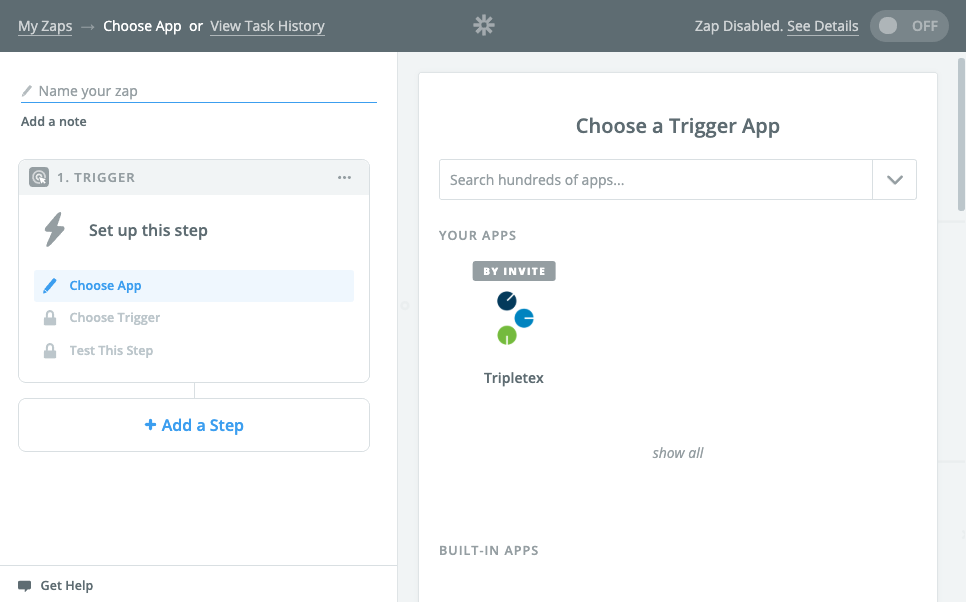
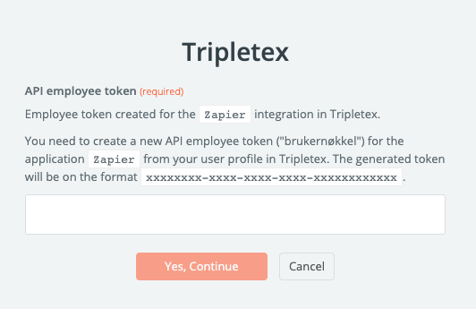
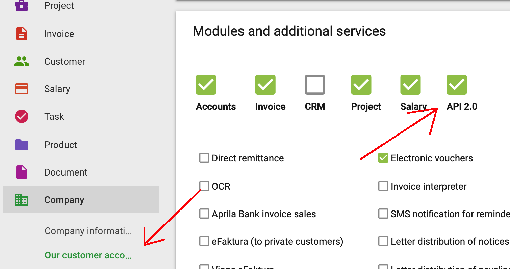
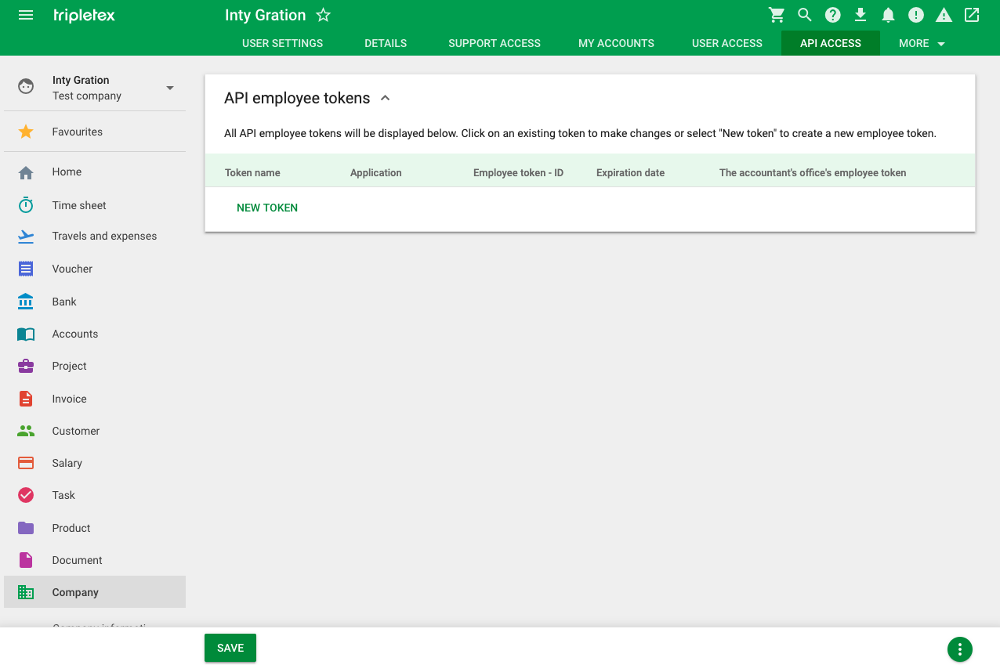
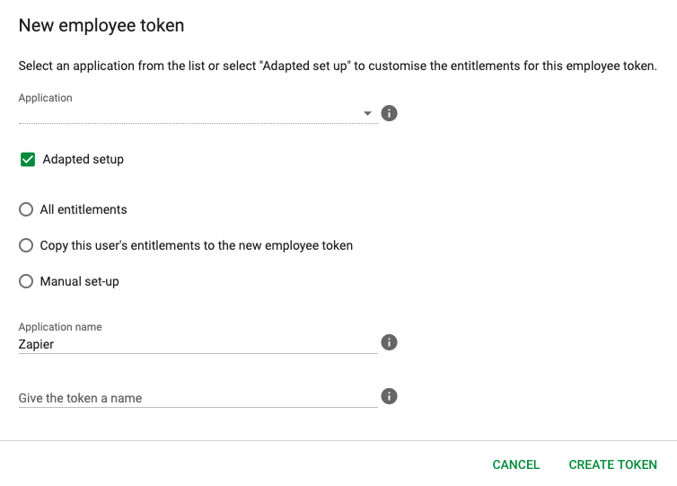

# Zapier Tripletex app

The Tripletex API is available as an app in [Zapier](https://zapier.com).

At the moment, the app is only available to beta-users.

### [Join the beta program here](https://zapier.com/developer/public-invite/14736/adfc54bf588f1593d0fe5a1442514dad/)

Contact **Tripletex technical support** for questions regarding the Zapier app.

teknisk-support@tripletex.no

---

## Frequently asked questions

### What is Zapier?

Zapier is a tool for connecting apps without having to code your own integration. Examples of these apps are Google Calendar, Slack, Mailchimp, and now Tripletex. Typical use-cases can be

- Every time an event is created in **Google Calendar**, send me a message on **Slack**
- Every time a tweet is sent on **Twitter**, add it as a row to a **Google Sheet**

### What is possible with the Tripletex Zapier app?

At the moment, the Zapier app is focused on **triggering events**, rather than **performing actions**. This means that you may perform actions in other systems using triggers from Tripletex events.

Events are based on the [webhook system](../webhooks), so everything available as webhooks will be available as Zapier triggers.

Example usages using the Tripletex app:

- Every time a customer is created in **Tripletex**, send an e-mail from **Mailchimp**
- Every time you receive a notification in **Tripletex**, send me a message on **Slack**

### How do I get started?

Create an account on [zapier.com](https://zapier.com) and then join the [beta-program](https://zapier.com/developer/public-invite/14736/adfc54bf588f1593d0fe5a1442514dad/)!

### Who do I ask for help?

Contact **Tripletex technical support** if you have any questions.

---

## Setup

After you have join the beta program, you may search for "Tripletex" when creating a new Zapier zap.

2. During setup, you are asked to connect your Tripletex account to Zapier. This requires you to set up an API token for the "Zapier" integration.

3. To get this token, you first need to verify that your company has the "API 2.0" module activated. This can be activated from "Our company account" under "Company".

4. Once the "API 2.0" module has been acivated, you may create API tokens from the "API Access" tab on your user profile.

5. For Zapier, you need to specify "Adapted setup", and then give the application name "Zapier" to create a valid token for the Zapier app.

6. Once the employee token has been created, you may copy the value into the Zapier authentication dialog (from step 2) and proceed setting up your zap.
